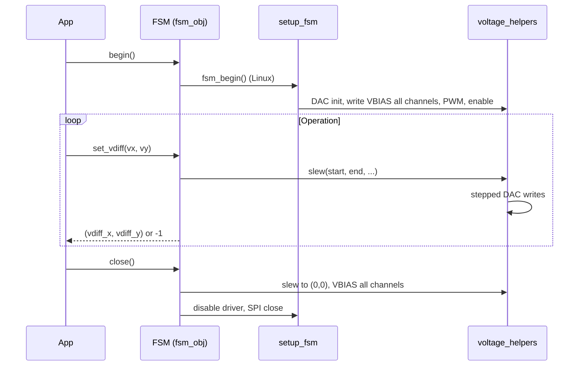

# Mirrorcle MEMS driver — Python API (`rasppi_src`)

This folder contains a **Python control layer** for a Mirrorcle-style MEMS mirror driven by a **quad DAC over SPI**, with **driver enable** and **filter clock (FCLK) PWM** on a Linux SBC (typically **Raspberry Pi**). The main object you use in application code is **`FSM`** in `fsm_obj.py`.

---

## Safety (read first)

- **VDIFF** is the differential voltage used for each axis: for X it is effectively **channel 0 − channel 1**; for Y, **channel 3 − channel 2** (see mapping below).
- Hardware limits depend on **VBIAS** and your mirror. **Do not exceed safe differential limits** for your device; the constants in `constants.py` are software guardrails, not a substitute for hardware review.
- **`close()`** runs a **slew back to zero VDIFF** (all channels at VBIAS) before disabling the driver — do not rely on “pulling power” alone.

---

## What to configure: `constants.py`

**Treat `constants.py` as the single source of truth** for voltages, slew behavior, SPI timing, and GPIO pins used by `setup_fsm.py` and `voltage_helpers.py`.

| Area | Typical symbols | Role |
|------|-----------------|------|
| Bias and range | `VBIAS`, `VDIFF_MIN_VOLTS`, `VDIFF_MAX_VOLTS` | Operating point and allowed VDIFF input range |
| Channel limit | `V_MAX_CHANNEL`, `V_MAX_DIGITAL` | Max per-channel voltage / DAC code for writes |
| Slew | `SLEW_RATE_MS`, `SLEW_AMOUNT_V` | Sleep between steps and step size when moving to a new VDIFF |
| FCLK | `FCLK_PWM_PIN_1`, `FCLK_PWM_PIN_2`, `FCLK_HZ`, `FCLK_DUTY_PERCENT` | Hardware PWM for the filter clock (two pins) |
| Driver enable | `DAC_ENABLE_LINE` | GPIO that enables the MEMS driver (must be valid for your wiring) |
| SPI | `SPI_MODE`, `SPI_MAX_SPEED` | SPI0 to the DAC |

If limits or pins disagree between files, behavior can look “inconsistent” (software state vs. what the DAC outputs). Keep everything aligned with `constants.py`.

---

## Core API: `FSM` (`fsm_obj.py`)

### Construction

```python
from fsm_obj import FSM

fsm = FSM()                          # defaults: slew from setup_fsm/constants
fsm = FSM(slew_time=..., slew_step=...)  # optional overrides
```

### Methods

| Method | Returns | Description |
|--------|---------|-------------|
| `begin()` | `int` | **Linux:** runs `setup_fsm.fsm_begin()` — interactive confirmation, DAC init, all channels to VBIAS, FCLK PWM, driver enable high. Returns **`0`** on success, **`-1`** if setup aborted or failed. **Non-Linux (e.g. macOS):** no hardware; returns **`1`** (“test mode”) and sets internal `spi`/`enable` placeholders. |
| `set_vdiff(vdiff_x, vdiff_y)` | `tuple` or **`-1`** | Requests a new **VDIFF** for X and Y. Values are checked against **`VDIFF_MIN_VOLTS` / `VDIFF_MAX_VOLTS`** (via `setup_fsm`, sourced from `constants`). On success, slews from current state and updates internal `vdiff_x` / `vdiff_y`. Returns **`-1`** if out of range. Partial slew failures can leave the mirror short of the target (see prints in `fsm_obj`). |
| `get_voltages()` | `(vdiff_x, vdiff_y)` | Last commanded VDIFF state tracked by the object (not a live ADC readback). |
| `update_slew(slew_time, slew_step)` | `0` | Changes slew parameters for subsequent moves. |
| `get_slew_stats()` | `(slew_time, slew_step)` | Prints and returns current slew parameters. |
| `is_active()` | `bool` | Whether `spi` and `enable` handles are set (after `begin()` before `close()`). |
| `close()` | — | Calls `setup_fsm.fsm_close(...)`: **slews to (0, 0) VDIFF**, writes all channels to VBIAS, disables driver, closes SPI on Linux. Clears internal state. |

### VDIFF → DAC channels

Mapping is implemented in `voltage_helpers.vdiff_to_channel_voltage`:

- **X axis:** `ch0 = VBIAS + vdiff_x/2`, `ch1 = VBIAS - vdiff_x/2`
- **Y axis:** `ch2 = VBIAS - vdiff_y/2`, `ch3 = VBIAS + vdiff_y/2`

So **VDIFF on an axis** is the difference across the pair for that axis (e.g. `ch0 - ch1` = `vdiff_x`).

---

## Typical control flow



1. **`FSM()`** — construct.
2. **`begin()`** — hardware init; confirm prompts on device.
3. **`set_vdiff(...)`** — repeat as needed; use **`get_voltages()`** to read back the object’s idea of current VDIFF.
4. **`close()`** — always on shutdown (Ctrl+C handlers should call it in `finally`).

---

## Supporting modules (for integrators)

| Module | Role |
|--------|------|
| `setup_fsm.py` | **Order-sensitive** bring-up and shutdown: SPI, DAC init sequence, VBIAS on all channels, FCLK PWM (`pigpio.hardware_pwm`), driver enable GPIO. Imports timing and limits from **`constants.py`**. |
| `voltage_helpers.py` | `vdiff_to_channel_voltage`, `slew` / `slew_x` / `slew_y`, `channel_voltage_to_digital`, `write_dac_channel`, `send_dac_command`. Use this layer if you build custom trajectories while still using the same DAC encoding. |
| `control_flows.py` | Legacy / helper patterns (not fully wired for all paths). |
| `voltage_mapping_main.py` | **Click** CLI for camera-centric mapping sweeps (`src.picam`, `src.centroiding`). |
| `src/picam.py` | Picamera2 init, YUV grayscale frames, **`close_camera`** cleanup; shared with `config/get_calib_photos.py`. |

---

## Hardware connections (summary)

Exact wiring depends on your board revision; align with your schematic.

- **SPI (DAC):** Program uses **`spidev` SPI0** (`bus 0`, `device 0` in `setup_fsm.fsm_begin`). Connect **MOSI, SCLK, CE0** (and MISO if required by your DAC). CS pin may be configurable in hardware docs.
- **Driver enable:** **`DAC_ENABLE_LINE`** in `constants.py` — GPIO output; sequence drives enable **low** during init, **high** when ready.
- **FCLK:** Two PWM outputs on **`FCLK_PWM_PIN_1`** and **`FCLK_PWM_PIN_2`** at `FCLK_HZ` / duty from `constants.py`. Ensure pins are configured for PWM on your Pi (e.g. `raspi-gpio` / `dtoverlay` as appropriate for your model).

Interactive scripts in this repo (e.g. `go_to_voltage_main.py`) echo that **VDIFF must not exceed `2 * VBIAS`** in the sense of mirror stress — keep software limits consistent with hardware.

---

## Entry points

| Script | Purpose |
|--------|---------|
| `go_to_voltage_main.py` | Minimal REPL: `begin()`, loop `input("vdiffx vdiffy")`, `set_vdiff`, `close()`. |
| `voltage_mapping_main.py` | Camera + sweep / manual stepping for calibration CSV output. |
| `config/get_calib_photos.py` | Capture ChArUco stills with **Picamera2** (same pipeline as `src/picam.py`). |
| `config/calibrate_picam.py` | OpenCV ChArUco lens calibration; writes `config/camera_params.npz`. |

**Note:** `go_to_voltage_main.py` may reference `drive_sine` in the `sin` branch; that method is **not** defined on `FSM` in this tree — use `set_vdiff` patterns or implement a sweep if you need periodic motion.

---

## Camera calibration (Picamera2 + OpenCV)

Calibration capture and voltage mapping share **`src/picam.py`**: YUV420 video at a fixed **(width, height)** (default **640×480** via `DEFAULT_FRAME_SIZE`). This avoids the old mismatch between OpenCV `VideoCapture` and Picamera2.

**Workflow**

1. **Capture** — From the repo root (or any cwd with `src` importable), run `config/get_calib_photos.py`. It saves JPEGs under `config/calib_images/`. Adjust `FRAME_SIZE` in that script to match your experiment; it must match the **`--resolution`** width passed to `voltage_mapping_main.py` (height is 480 unless you change `src/picam.py` and the capture script together).
2. **Calibrate** — Run `config/calibrate_picam.py`. It reads `config/calib_images/*.jpg`, runs `calibrateCameraCharuco`, and writes **`config/camera_params.npz`** (includes `mtx`, `dist`, `rms`). Calibration fails loudly if too few detections or RMS reprojection error is too high (see `MAX_RMS_PIXELS` in that file).
3. **Map** — Run `voltage_mapping_main.py` with the same width so intrinsics apply consistently if you later wire undistortion into the centroid pipeline.

**Important:** `src/centroiding.py` does **not** load `camera_params.npz` yet. Centroids are computed on raw grayscale from Picamera2. To use lens correction or homography (`get_homography_matrix` / `get_laser_position_mm` in `config/calibrate_picam.py`), add a small preprocessing step (load `npz`, `cv2.undistort`, optional `perspectiveTransform`) before `find_laser_centroid` — that integration is left for a follow-up.

---

## Tips for working with `FSM`

1. **Check `begin()` return value:** `0` = Linux OK, `1` = test mode, `-1` = failed or user aborted.
2. **Check `set_vdiff` return:** `-1` means out-of-range; the internal VDIFF is not updated to the new target in that case.
3. **Slew vs. instant:** Moves are stepped using `SLEW_RATE_MS` and `SLEW_AMOUNT_V`; large jumps take longer.
4. **State vs. mirror:** `get_voltages()` reflects **software state** after successful `slew` segments; if the slew aborts early, prints may indicate a partial move.
5. **Development off-Pi:** On non-Linux, `begin()` returns `1` and SPI writes are skipped (`voltage_helpers.IS_LINUX` gates actual DAC traffic); use this only for logic testing, not mirror validation.

---

## Appendix: Raspberry Pi 40-pin GPIO reference (legacy table)

User GPIO 0-1, 4, 7-11, 14-15, 17-18, 21-25.

GPIO	pin	pin	GPIO	
3V3	-	1	2	-	5V
SDA	0
3	4	-	5V
SCL	1
5	6	-	Ground

4	7	8	14	TXD
Ground	-	9	10	15	RXD
ce1	17	11	12	18	ce0

21	13	14	-	Ground

22	15	16	23	
3V3	-
17	18	24	
MOSI	10	19	20	-	Ground
MISO	9	21	22	25	
SCLK	11	23	24	8	CE0
Ground	-	25	26	7	CE1
